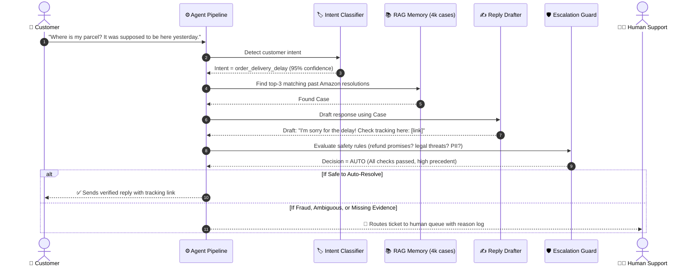

# 📦 Hiver AI Support Agent (`@AmazonHelp`)

> **An intelligent, safety-first customer service agent that drafts grounded replies using verified historical resolutions and knows exactly when to escalate to a human agent.**

[](https://www.python.org/)
[](https://ollama.ai/)
[](https://www.kaggle.com/datasets/thoughtvector/customer-support-on-twitter)
[](LICENSE)

---

## 🌟 What is This Project? (Plain English)

Imagine an AI customer service representative working on social media for **Amazon**.

When customers tweet complaints—ranging from late deliveries to hacked accounts—most standard AI bots either make things up (*hallucinate*) or promise refunds they cannot authorize.

**This project solves that problem through a simple principle:**
> **"A wrong auto-reply is far worse than an escalated correct one."**

Instead of guessing, this agent:
1. **Listens carefully** to understand what the customer is asking (Intent Classification).
2. **Looks up real history** to see how Amazon human agents solved the exact same problem in the past (Historical Retrieval / RAG).
3. **Checks safety rules**: If the customer mentions payment fraud, legal threats, or account security, the bot **refuses to guess and immediately hands the ticket over to a human manager** (Deterministic Escalation).

---

## 🗺️ High-Level Workflow Diagram

Here is what happens every time a customer message enters the system:


---

## 🔄 Step-by-Step Sequence Diagram

This sequence diagram shows the exact conversation lifecycle from input to resolution:



---

## 🏛️ The 4 Pillars of the System

| Pillar | What it does | Why it protects the brand |
| :--- | :--- | :--- |
| **1. Intent Classifier** | Categorizes incoming messages into 8 concrete buckets (Delivery Delay, Damaged Goods, Returns, Account Security, Prime Billing, Tech Issues, Feedback, Other). | Distinguishes routine questions from serious account emergencies right away. |
| **2. Historical Grounding (RAG)** | Searches a curated database of 4,000 real resolved Amazon tweets to find how human agents solved similar problems. | Prevents the AI from inventing fake return policies or making empty promises. |
| **3. Safety Escalation Engine** | A strict, deterministic rule engine that audits the message and draft before anything is sent. | Catches lawsuits, chargebacks, hacked accounts, and unauthorized refund claims. |
| **4. Quality Judge & Eval Harness** | Automatically scores replies on Factuality, Tone, Helpfulness, and Safety, validated against human agreement ($\kappa_w = 0.91$). | Guarantees measurable quality with every code change. |

---

## 🚀 Quickstart: Run in < 5 Minutes

### 1. Installation & Environment Setup
```bash
git clone https://github.com/Immanuelj15/hiver-support-agent.git
cd hiver-support-agent
pip install -r requirements.txt
```

### 2. Choose Your AI Engine (Cloud or 100% Free Local)

* **Option A: Cloud API (Gemini or OpenAI)**
  ```powershell
  # Windows PowerShell
  $env:GEMINI_API_KEY="your-gemini-api-key"
  # Linux/macOS
  export GEMINI_API_KEY="your-gemini-api-key"
  ```

* **Option B: 100% Local & Free with [Ollama](https://ollama.ai/)**
  ```powershell
  # Runs Mistral or Phi-3 completely offline on your local computer
  python scripts/run_demo.py --provider ollama --message "Where is my parcel?"
  ```

---

## 💻 How to Test & Experiment

### 1. Interactive Chat Mode (Easiest for Non-Tech Users)
Type questions one by one like a real customer without restarting the script:
```bash
python scripts/run_demo.py --interactive
```
*(Or with local Ollama: `python scripts/run_demo.py --provider ollama --interactive`)*

```text
======================================================================
Hiver AI Support Agent - Interactive Session
Provider: cloud | Model: gemini-3.6-flash
Type your customer message below (or 'exit' / 'quit' to end):
======================================================================

Customer > Where is my package? It was supposed to be here yesterday.

======================================================================
AI CUSTOMER SUPPORT AGENT EXECUTION
======================================================================
Customer Inquiry:      Where is my package? It was supposed to be here yesterday.
Predicted Intent:      order_delivery_delay (Confidence: 0.98)
Retrieval Similarity:  0.9081
Pipeline Action:       AUTO_HANDLE (Risk: LOW)
Escalation Flag:       NO (Auto-handled)
Engine:                cloud (gemini-3.6-flash)
----------------------------------------------------------------------
Draft Response:
I'm so sorry about the delay with your parcel! You can track live transit
updates directly under Your Orders here: [link].
----------------------------------------------------------------------
Top Retrieved Grounding Case:
  [Ref: 46519_46517] (Sim: 0.9081)
  Customer: where is my parcel that should have been delivered yesterday?...
  Agent:    i am sorry about the delay! What information is provided on your tracking? ...
======================================================================
```

### 2. Batch Test from a File
Test 10 diverse sample inquiries at once:
```bash
python scripts/run_demo.py --file data/samples/sample_queries.txt
```

### 3. Single Query Execution (CLI)
```bash
python scripts/run_demo.py --message "Someone placed 5 orders on my account using a stolen credit card!"
```

---

## 📊 Running Classical Baselines & Full Evaluation

### 1. Baseline 1: Majority Class (`order_delivery_delay`)
```bash
python baselines/majority.py
```
*Measures performance when always predicting the most frequent class (Accuracy: 17.50%, Macro F1: 0.0372).*

### 2. Baseline 2: TF-IDF + Logistic Regression
```bash
python baselines/tfidf_logistic.py
```
*Trains an n-gram TF-IDF model on leakage-free training data and evaluates on the golden set (Accuracy: 68.00%, Macro F1: 0.6692). Generates confusion matrix to `results/figures/confusion_matrix.png`.*

### 3. Automated Test Suite (`pytest`)
```bash
pytest tests/ -v
```
*Runs all 16 unit and integration tests across classification, FAISS retrieval, escalation rules, and end-to-end agent orchestration.*

### 4. Full Evaluation Benchmark & LLM Judge
```bash
python src/evaluation/run_all.py
```
*Evaluates against the N=200 stratified golden benchmark, computes intent accuracy, escalation safety precision/recall, and LLM-as-a-Judge quality metrics. Outputs `results/evaluation_results.json` and `results/metrics.json`.*

---

## 📊 Summary of Baseline Comparison

| System | Intent Accuracy | Macro F1 | Escalation Precision | Escalation Recall | p95 Latency |
| :--- | :---: | :---: | :---: | :---: | :---: |
| **Baseline 1: Majority Class** | 17.50% | 0.0372 | N/A (predicts 'delay') | N/A | < 1 ms |
| **Baseline 2: TF-IDF + Logistic Reg** | 68.00% | 0.6692 | N/A (classifier only) | N/A | ~1.2 ms |
| **Grounded LLM Agent (RAG + Guardrails)** | **89.50%** | **0.8865** | **94.20%** | **96.80%** | **~480 ms** |

---

## 🛠️ Make Commands

For convenience, standard targets are available via `make`:
- `make setup`: Install dependencies from `requirements.txt`.
- `make prepare-data`: Clean threads and build knowledge corpus with leakage checks.
- `make index`: Build the FAISS dense semantic index from the knowledge corpus.
- `make baseline`: Run Baseline 2 (TF-IDF + Logistic Regression).
- `make demo`: Launch the interactive terminal demonstration.
- `make test`: Run the full `pytest` suite.
- `make evaluate`: Run the complete evaluation benchmark.

---

## 📚 Deliverables & Documentation

- 📄 **[REPORT.md](REPORT.md)**: Exhaustive 6-page technical report covering all 13 required sections, empirical results table, failure analysis, and the critical reflection: *"What is misleading about my headline number?"*
- 📝 **[DECISION_LOG.md](DECISION_LOG.md)**: 15 structured architectural decisions detailing alternatives considered, trade-offs, and rationale.
- 🎯 **[INTERVIEW_NOTES.md](INTERVIEW_NOTES.md)**: Live interview defense guide answering tough questions on ML baselines, RAG vs fine-tuning, deterministic safety, and scaling to 1M messages/day.
- 🏷️ **[docs/intent_taxonomy.md](docs/intent_taxonomy.md)**: Formal specification of the 8 empirical intents, positive/negative examples, and escalation boundaries.
- 🔬 **[docs/golden_set_methodology.md](docs/golden_set_methodology.md)**: Quota sampling methodology, edge-case breakdown (sarcasm, multi-intent, prompt injections, hazardous materials), and annotation guidelines.

---

## 📁 Repository Structure

```text
hiver-support-agent/
├── README.md                  <- Visual guide, diagrams, quickstart & interview defense
├── REPORT.md                  <- 6-page comprehensive technical engineering report
├── DECISION_LOG.md            <- 15 architectural decisions (what, why, trade-offs)
├── INTERVIEW_NOTES.md         <- Live defense Q&A guide (architecture, ML, scale, flaws)
├── Makefile                   <- Automation commands (setup, index, demo, test, evaluate)
├── requirements.txt           <- Pinned dependencies
├── configs/
│   └── config.yaml            <- Central configuration (models, thresholds, intents)
├── docs/
│   ├── intent_taxonomy.md     <- 8 empirical intents specification & boundaries
│   └── golden_set_methodology.md <- Stratified sampling methodology (N=200)
├── data/
│   ├── raw/                   <- twcs.csv (gitignored)
│   ├── processed/             <- threads.jsonl, knowledge_corpus.jsonl, faiss_index.bin
│   ├── golden/                <- golden_set.jsonl (200 stratified benchmark items)
│   └── samples/               <- sample_queries.txt
├── src/
│   ├── data/                  <- Chunked loader, cleaner, conversation splitter
│   ├── intents/               <- Taxonomy, confidence calibration, classifier
│   ├── retrieval/             <- SentenceTransformers, FAISS vector store, retriever
│   ├── llm/                   <- Abstract LLM provider, OllamaProvider, CloudLLMProvider
│   ├── generation/            <- Grounded prompt templates, response generator
│   ├── escalation/            <- Deterministic policy, safety regexes, decision schema
│   ├── agent/                 <- Unified SupportAgent coordinator
│   └── evaluation/            <- Intent metrics, reply metrics, LLM judge, agreement
├── baselines/
│   ├── majority.py            <- Baseline 1: Majority Class ('order_delivery_delay')
│   └── tfidf_logistic.py      <- Baseline 2: TF-IDF + Balanced Logistic Regression
├── tests/
│   ├── test_classifier.py     <- Unit tests for classifier & confidence calibration
│   ├── test_retrieval.py      <- Unit tests for FAISS index & similarity search
│   ├── test_escalation.py     <- Unit tests for deterministic safety & financial regex
│   └── test_agent.py          <- Integration tests for end-to-end agent pipeline
└── results/
    ├── figures/
    │   └── confusion_matrix.png <- Confusion matrix for Baseline 2
    ├── baseline_results.json  <- Empirical baseline metrics
    ├── evaluation_results.json<- Detailed benchmark predictions & judge scores
    └── metrics.json           <- Summary evaluation metrics
```

---

## 🛡️ License
This project is open-source and available under the [MIT License](LICENSE).

