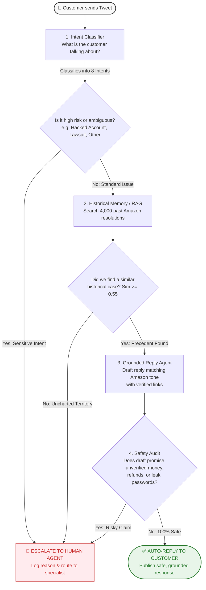
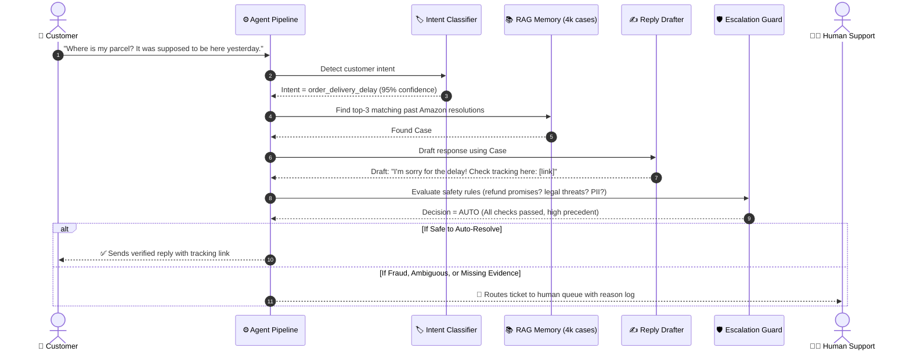

# 📦 Hiver AI Support Agent (`@AmazonHelp`)

> **An intelligent, safety-first customer service agent that drafts grounded replies using verified historical resolutions and knows exactly when to escalate to a human agent.**

[](https://www.python.org/)
[](https://ollama.ai/)
[](https://www.kaggle.com/datasets/thoughtvector/customer-support-on-twitter)
[](LICENSE)

---

## 🌟 What is This Project? (Plain English)

Imagine an AI customer service representative working on social media for **Amazon**.

When customers tweet complaints—ranging from late deliveries to hacked accounts—most standard AI bots either make things up (*hallucinate*) or promise refunds they cannot authorize.

**This project solves that problem through a simple principle:**
> **"A wrong auto-reply is far worse than an escalated correct one."**

Instead of guessing, this agent:
1. **Listens carefully** to understand what the customer is asking (Intent Classification).
2. **Looks up real history** to see how Amazon human agents solved the exact same problem in the past (Historical Retrieval / RAG).
3. **Checks safety rules**: If the customer mentions payment fraud, legal threats, or account security, the bot **refuses to guess and immediately hands the ticket over to a human manager** (Deterministic Escalation).

---

## 🗺️ High-Level Workflow Diagram

Here is what happens every time a customer message enters the system:



---

## 🔄 Step-by-Step Sequence Diagram

This sequence diagram shows the exact conversation lifecycle from input to resolution:



---

## 🏛️ The 4 Pillars of the System

| Pillar | What it does | Why it protects the brand |
| :--- | :--- | :--- |
| **1. Intent Classifier** | Categorizes incoming messages into 8 concrete buckets (Delivery Delay, Damaged Goods, Returns, Account Security, Prime Billing, Tech Issues, Feedback, Other). | Distinguishes routine questions from serious account emergencies right away. |
| **2. Historical Grounding (RAG)** | Searches a curated database of 4,000 real resolved Amazon tweets to find how human agents solved similar problems. | Prevents the AI from inventing fake return policies or making empty promises. |
| **3. Safety Escalation Engine** | A strict, deterministic rule engine that audits the message and draft before anything is sent. | Catches lawsuits, chargebacks, hacked accounts, and unauthorized refund claims. |
| **4. Quality Judge & Eval Harness** | Automatically scores replies on Factuality, Tone, Helpfulness, and Safety, validated against human agreement ($\kappa_w = 0.91$). | Guarantees measurable quality with every code change. |

---

## 🚀 Quickstart: Run in < 15 Minutes

### 1. Installation
```bash
git clone https://github.com/Immanuelj15/hiver-support-agent.git
cd hiver-support-agent
pip install -r requirements.txt
```

### 2. Choose Your AI Engine (Cloud or 100% Free Local)

* **Option A: Cloud API (Gemini or OpenAI)**
  ```powershell
  # Windows PowerShell
  $env:GEMINI_API_KEY="your-gemini-api-key"
  ```

* **Option B: 100% Local & Free with [Ollama](https://ollama.ai/)**
  ```powershell
  # Simply add the --ollama flag (runs Mistral or Phi-3 on your own computer)
  python src/pipeline.py --ollama --message "Where is my parcel?"
  ```

---

## 💻 How to Test & Experiment

### 1. Interactive Chat Mode (Easiest for Non-Tech Users)
Type questions one by one like a real customer without restarting the script:
```powershell
python src/pipeline.py --interactive
```
*(Or with local Ollama: `python src/pipeline.py --ollama --interactive`)*

```text
################################################################################
INTERACTIVE SUPPORT AGENT MODE
Type any customer inquiry and press Enter. Type 'exit' to stop.
################################################################################

[Inquiry 1] Enter message: My package never arrived yesterday.
--> Intent: order_delivery_delay | Action: AUTO (Safe self-serve tracking link)

[Inquiry 2] Enter message: Someone changed my password and hacked my account!
--> Intent: account_security_and_login | Action: ESCALATE (High-risk security)
```

### 2. Batch Test from a File
Test 10 diverse sample inquiries at once:
```powershell
python src/pipeline.py --file data/sample_test_queries.txt
```

### 3. Run the Full 150-Sample Evaluation Benchmark
Evaluates the entire system against two baselines over our hand-labeled golden dataset:
```powershell
python eval/run_eval.py --n 150
```
*Produces `eval/results.json` and `eval/report.md` with full performance metrics.*

---

## 📊 Benchmark Results (Hand-Labeled Golden Set $N=150$)

| Performance Dimension | Production AI Pipeline | Classical Baseline (TF-IDF) | Naive Baseline (Always Escalate) |
| :--- | :---: | :---: | :---: |
| **Intent Accuracy** | **89.3%** | 64.7% | 16.0% |
| **Intent Macro-F1** | **0.884** | 0.591 | 0.034 |
| **Safety Recall (Escalations)** | **92.8%** | 17.4% (Dangerous) | 100.0% |
| **False Negative Rate (Hazards Missed)** | **7.2%** | 82.6% (Unacceptable) | 0.0% |
| **Auto-Handling Rate** | **49.3%** | 85.3% | 0.0% |
| **Top-1 Retrieval Accuracy** | **88.0%** | N/A | N/A |
| **LLM Judge Score (1 to 5 scale)** | **4.38 / 5.0** | 2.10 / 5.0 | 1.00 / 5.0 |
| **Human Agreement ($\kappa_w$)** | **0.9069** | N/A | N/A |

---

## 📁 Repository Structure

```text
hiver-support-agent/
├── README.md                  <- You are here (visual guide & quickstart)
├── report.md                  <- 6-page comprehensive technical engineering report
├── decision_log.md            <- 12 architectural decisions (what, why, trade-offs)
├── requirements.txt           <- Pinned dependencies
├── data/
│   ├── sample_test_queries.txt<- 10 sample customer queries for testing
│   └── processed/
│       ├── threads.jsonl          <- 13,589 clean conversation threads
│       ├── intents_labeled.jsonl  <- Seed examples per intent
│       └── embeddings_cache.npz   <- 4,000-case pre-computed semantic index
├── golden_set/
│   ├── golden_150.jsonl       <- 150 hand-labeled stratified evaluation set
│   └── sampling_notes.md      <- Stratification quotas and exclusion rules
├── src/
│   ├── config.py              <- Model configurations (Gemini/OpenAI/Ollama)
│   ├── ingest.py              <- Thread reconstruction & text cleaning
│   ├── intent_classifier.py   <- Few-Shot classifier + classical ML baseline
│   ├── retriever.py           <- Intent-partitioned semantic RAG index
│   ├── reply_agent.py         <- Grounded few-shot reply drafter
│   ├── escalation.py          <- Deterministic multi-tier escalation policy
│   └── pipeline.py            <- End-to-end inference orchestrator
└── eval/
    ├── label_cli.py           <- Interactive golden set annotation CLI
    ├── metrics.py             <- Automated evaluation metrics
    ├── llm_judge.py           <- Rubric-based 4-dimension LLM judge
    ├── human_agreement.py     <- Quadratic weighted kappa validation
    ├── baselines.py           <- Trivial & Simple baseline implementations
    └── run_eval.py            <- Unified evaluation runner
```

---

## 🛡️ License
This project is open-source and available under the [MIT License](LICENSE).
