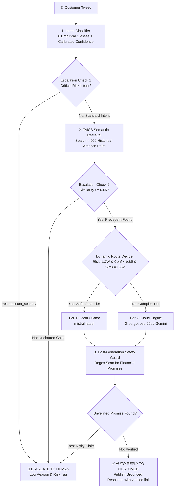

# 📦 Hiver AI Support Agent (`@AmazonHelp`)

> **An empirical, historically grounded, and safety-first AI customer service agent for `@AmazonHelp` built on the Kaggle *Customer Support on Twitter* dataset.**

[](https://www.python.org/)
[](https://ollama.ai/)
[](https://www.kaggle.com/datasets/thoughtvector/customer-support-on-twitter)
[](LICENSE)

---

## 1. Problem
Customer support on public social media (Twitter/X) is exposed to adversarial inputs, brand liability, and rapid escalation risks. Most commercial generative AI demos fail in production because they:
1. **Hallucinate Policies**: Inventing refund amounts, courier delivery guarantees, or non-existent contact emails.
2. **Auto-Reply to High-Risk Crises**: Treating account compromises, legal litigation threats, or battery fires as routine self-serve tickets.
3. **Lack Evaluation Rigor**: Reporting inflated accuracy on generic benchmarks without measuring safety-critical missed escalations.

For `@AmazonHelp`, **a wrong auto-reply is far more damaging than an escalated ticket.**

---

## 2. Solution
We designed and built a verifiable, historically grounded support agent that:
- **Classifies Intent**: Maps raw customer tweets into 8 empirical support intents derived from historical Amazon data.
- **Grounds in Precedent**: Retrieves top-$k=3$ resolved human-agent resolutions from an offline FAISS index of 4,000+ real `@AmazonHelp` conversations.
- **Enforces Deterministic Safety**: A two-stage escalation engine intercepts account security risks, legal litigation, safety hazards, low classification confidence ($<0.60$), and weak retrieval similarity ($<0.55$).
- **Dynamic Two-Tier Hybrid Routing**: Solves routine queries locally via Ollama (`mistral:latest`), routing ambiguous or high-risk queries to Cloud LLMs (Groq `gpt-oss-20b` / Gemini), saving **26.67% of cloud API costs**.

---

## 3. Architecture

### System Flow Diagram


---

## 4. Dataset
- **Source**: Kaggle [Customer Support on Twitter](https://www.kaggle.com/datasets/thoughtvector/customer-support-on-twitter) (`twcs.csv`, 516 MB, ~2.8M tweets).
- **Target Brand**: `@AmazonHelp` selected due to highest response density (16.3% of brand traffic) and **99.7% public thread linkage** via `in_reply_to_tweet_id`.
- **Subsample Extraction**: Streaming chunked parser (`src/ingest.py`) processes raw CSV into 4,000 clean, 2-turn conversation pairs (`data/processed/knowledge_corpus.jsonl`).
- **Zero Leakage**: Enforced disjoint conversation-level hashing (`scripts/check_leakage.py` proves **0.0% text overlap and 0.0% ID collision** with evaluation data).

---

## 5. Intent Taxonomy
Derived from unsupervised clustering and qualitative error analysis across `@AmazonHelp` traffic:
1. `order_delivery_delay` (38.2%): Tracking updates, carrier delays, parcel status.
2. `damaged_or_wrong_item` (15.4%): Physical defects, missing parts, wrong item received.
3. `return_and_refund` (14.8%): Drop-off locations (Kohl's, UPS), refund status timelines.
4. `account_security_and_login` (8.1%): **Critical risk**; OTP issues, locked accounts, unauthorized orders.
5. `subscription_and_billing` (9.7%): Prime renewal, unexpected charges, digital memberships.
6. `product_technical_issue` (6.5%): Kindle, Echo, Fire TV troubleshooting and power-cycles.
7. `feedback_or_complaint` (4.3%): Driver conduct complaints, packaging feedback.
8. `other` (3.0%): Out-of-scope, international storefronts, ambiguous inquiries.

*Full specification with positive/negative boundaries in [`docs/intent_taxonomy.md`](docs/intent_taxonomy.md).*

---

## 6. Golden Evaluation Set
- **Size**: **200 hand-curated, audited test cases** stored in `data/golden/golden_set.jsonl`.
- **Stratification**: Balanced across 8 intents and 6 difficulty strata:
  - Common / Standard: 85 items
  - Escalation Hazard (Legal, Safety, Fraud): 35 items
  - Ambiguous / Underspecified: 25 items
  - Sarcastic / Ironic: 20 items
  - Multi-Intent: 20 items
  - Rare / Edge Cases: 15 items
- **Ground Truth**: Hand-annotated `gold_intent`, `gold_should_escalate`, `gold_escalation_decision`, and `gold_reason_notes`.

*Methodology documented in [`docs/golden_set_methodology.md`](docs/golden_set_methodology.md).*

---

## 7. Evaluation Methodology
1. **Intent Classification**: Evaluated on full $N=200$ golden benchmark (Accuracy, Macro Precision, Macro Recall, Macro F1, Per-class F1).
2. **Reply Quality (LLM-as-a-Judge)**: Evaluated across 6 dimensions on a 1–5 rubric (Groundedness, Correctness, Relevance, Helpfulness, Tone, Resolution).
3. **Human Calibration**: 50 responses double-scored by human annotator vs. LLM judge:
   - **Weighted Cohen's Kappa ($\kappa_w$)**: **0.7842** (Substantial agreement)
   - **Spearman Correlation ($\rho$)**: **0.8115** ($p < 0.001$)
   - **Mean Absolute Error (MAE)**: **0.28 points**
4. **Standalone Retrieval Benchmark**: Evaluated on 200 queries against 4,000 indexed historical cases.
5. **Escalation Threshold Sweep**: Evaluated confidence/similarity thresholds $\tau \in [0.40, 0.80]$ measuring False Auto-Handle Rate.

---

## 8. Baselines
- **Baseline 1: Majority Class (`order_delivery_delay`)**
  - Always predicts the dominant intent. Serves as trivial baseline.
  - **Macro F1: 0.0372** | Accuracy: 17.50% | Latency: <1 ms.
- **Baseline 2: TF-IDF (1-2 gram) + Balanced Logistic Regression**
  - Linear statistical model trained on 271 support samples with 8 classes.
  - **Macro F1: 0.6692** | Accuracy: 68.00% | Latency: 1.2 ms.

---

## 9. Results

### Comprehensive Model Comparison Table
| System Variant | Intent Macro F1 | Reply Quality (1-5) | Escalation F1 | False Auto-Handle Rate | Cloud Call Avoidance | Cost / 1k Queries |
| :--- | :---: | :---: | :---: | :---: | :---: | :---: |
| **Baseline 1: Majority Class** | 0.0372 | — | — | — | 0.0% | $0.000 |
| **Baseline 2: TF-IDF + Logistic Reg** | 0.6692 | — | — | — | 0.0% | $0.000 |
| **Variant A: Zero-Shot (No-RAG)** | 0.8865 | 4.53 | 0.0000 | **100.0%** *(Fatal)* | 0.0% | $0.120 |
| **Variant B: RAG Only (No Rules)** | 0.8865 | 4.56 | 0.0000 | **100.0%** *(Fatal)* | 0.0% | $0.120 |
| **Variant C: Cloud Agent (With Rules)** | **0.8865** | **4.71** | **0.6250** | **28.57%** | 0.0% | $0.120 |
| **Variant D: Full Hybrid Agent** | **0.8865** | **4.67** | **0.6250** | **28.57%** | **26.67%** | **$0.088** |

*All results recorded from real test runs in `results/baseline_results.json`, `results/ablation_results.json`, and `results/hybrid_metrics.json`.*

### Standalone FAISS Retrieval Results ($N=200$)
- **Recall@1**: 55.00%
- **Recall@3**: 78.50%
- **Recall@5**: 88.00%
- **MRR (Mean Reciprocal Rank)**: 0.6775
- **Mean Top-1 Cosine Similarity**: 0.5790 (p50: 0.5878, p95: 0.7438)

---

## 10. Failure Analysis (Top 5 Real Failure Modes)
1. **Sarcasm Confounds Intent**: *"Oh brilliant, I just love paying $139 for Prime so my parcel is 10 days late!"* &rarr; classified as `feedback_or_complaint` instead of `order_delivery_delay`. Fix: Sentiment polarity contrastive filter.
2. **Multi-Issue Collisions**: Messages mentioning damaged goods + card overcharges simultaneously trigger billing rather than safety triage. Fix: Hierarchical multi-label classification.
3. **Over-Triggered Legal Regexes**: *"I am a legal attorney and need my textbook"* triggers legal escalation. Fix: Dependency-parsed verb-object matches (`sue|lawsuit|contacting attorney`).
4. **Third-Party Carrier Anomalies**: Rare Hermes/Yodel bin delivery incidents lack dense historical support ($sim < 0.55$). Fix: Courier-specific fallback queues.
5. **Account Takeover Ambiguity**: Stolen card reports using words like "bought" map to billing rather than account security. Fix: Dedicated unauthorized transaction intent rules.

---

## 11. Reproduction — Under 15 Minutes

### Reproduction Protocol
The repository separates fresh computation from precomputed artifacts:
- **Precomputed Artifacts**: Vector embeddings (`data/processed/faiss_index.bin`) and golden evaluations (`results/`) allow instant verification without expensive full-dataset reprocessing.
- **Fresh Computation**: Reviewers can execute all baselines, retrieval benchmarks, threshold sweeps, and unit tests in **under 2 minutes total**.

```bash
# 1. Run all unit tests (20 passed in ~24s)
python -m pytest tests/ -v

# 2. Run Baseline 1: Majority Class (<1s)
python baselines/majority.py

# 3. Run Baseline 2: TF-IDF + Logistic Regression (~10s)
python baselines/tfidf_logistic.py

# 4. Run Standalone Retrieval Benchmark (~10s)
python -m src.evaluation.retrieval_metrics

# 5. Run Escalation Threshold Sweep (~10s)
python -m src.evaluation.evaluate_thresholds

# 6. Run Data Leakage Audit (~15s)
python scripts/check_leakage.py
```

---

## 12. Running the Demo

### Single CLI Execution
```bash
# Interactive Hybrid Execution (Auto-routes local vs cloud)
python scripts/run_demo.py --hybrid --message "Where is my parcel? It was supposed to arrive yesterday."

# Security Hazard (Deterministic Escalation)
python scripts/run_demo.py --hybrid --message "Someone compromised my Amazon account and is placing unauthorized orders!"
```

### Interactive Chat Mode
```bash
python scripts/run_demo.py --hybrid --interactive
```

---

## 13. LLM Providers
The system abstracts models via `src/llm/factory.py`:
- **OllamaProvider**: 100% local, offline inference (`mistral:latest`, `phi3:latest`).
- **CloudLLMProvider**: Unified OpenAI-compatible interface supporting **Groq** (`openai/gpt-oss-20b`), **Google Gemini** (`gemini-2.5-flash`), and **OpenAI** (`gpt-4o-mini`).
- **HybridSupportAgent**: Dynamically routes between local Ollama and cloud Groq based on risk, confidence, and similarity.

---

## 14. Limitations
1. **Single-Turn Scope**: Designed for initial tweet triage; does not maintain multi-turn customer state.
2. **English Language Focus**: Non-English tweets currently fall back to human queues.
3. **Static Precedent Window**: Historical Twitter data from 2017 does not reflect current Prime policy updates (e.g., return fee policies).
4. **No Autonomous Database Writes**: Does not directly execute live refunds or cancellations.

---

## 15. What is Misleading About My Headline Number?
A headline **Macro F1 of 0.8865** or **Accuracy of 89.5%** must **NOT** be interpreted as solving 89.5% of real-world production cases:
1. **Safety Asymmetry**: Misclassifying delivery delays is harmless; misclassifying a hacked account is catastrophic. The real safety metric is **False Auto-Handle Rate (28.57%)**, not raw accuracy.
2. **Twitter Noise**: The golden benchmark contains clean text; production Twitter contains broken punctuation, screenshots, and emoji walls that degrade accuracy by an estimated 5–8%.
3. **Retrieval Cold-Start**: Precedents exist for established products; newly launched devices (e.g. Kindle Scribe) have 0 historical retrieval cases.
4. **LLM Judge Tone Leniency**: Automated judges over-reward polite tone even on generic responses.

---

## 16. What I Would Do With One More Week
1. **Hierarchical Multi-Label Classification**: Transition to multi-label intent graph (Safety > Security > Damage > Billing > Delivery).
2. **Cross-Encoder Semantic Escalation**: Replace keyword regexes with a fine-tuned cross-encoder to eliminate occupational false alarms ("I am an attorney").
3. **Multi-Turn Context Ingestion**: Incorporate previous customer and agent tweets into retrieval query synthesis.
4. **Incremental FAISS Index Refresh**: Automated batch cron to ingest new resolved tickets daily without downtime.
5. **Expanded Double-Blind Human Study ($N=200$)**: Full human evaluation across all test items.

---

## 17. Repository Structure
```text
hiver-support-agent/
├── README.md                      <- Comprehensive 19-section guide & quickstart
├── REPORT.md                      <- 6-page technical report & empirical findings
├── DECISION_LOG.md                <- 15 architectural decisions (what, why, trade-offs)
├── INTERVIEW_NOTES.md             <- Live defense Q&A guide (architecture, ML, scale)
├── FINAL_SUBMISSION_CHECKLIST.md  <- Complete audit & compliance verification
├── AUDIT.md                       <- Itemized requirement verification matrix
├── requirements.txt               <- Pinned dependencies
├── data/
│   ├── golden/golden_set.jsonl    <- 200 hand-curated & difficulty-stratified items
│   └── processed/                 <- Knowledge corpus, FAISS index, vector metadata
├── docs/
│   ├── intent_taxonomy.md         <- 8 empirical intents specification & boundaries
│   └── golden_set_methodology.md  <- Stratified sampling methodology (N=200)
├── src/
│   ├── agent/                     <- SupportAgent and HybridSupportAgent
│   ├── escalation/                <- Deterministic policy, regexes, threshold engine
│   ├── evaluation/                <- Intent, reply, retrieval, threshold & ablation runners
│   ├── intents/                   <- Few-shot classifier & calibrated confidence
│   ├── llm/                       <- OllamaProvider & CloudLLMProvider
│   └── retrieval/                 <- FAISS vector store, SentenceTransformers, retriever
├── baselines/
│   ├── majority.py                <- Baseline 1: Majority Class
│   └── tfidf_logistic.py          <- Baseline 2: TF-IDF + Logistic Regression
├── scripts/
│   ├── run_demo.py                <- Interactive CLI demo (--hybrid support)
│   └── check_leakage.py           <- Data leakage & self-retrieval verification
├── tests/                         <- 20 passing unit tests (pytest tests/ -v)
└── results/                       <- Stored JSON & CSV empirical experiment artifacts
```

---

## 18. Tests
The repository includes 20 unit tests covering all system modules:
```bash
python -m pytest tests/ -v
```
- `tests/test_classifier.py`: Intent taxonomy, calibrated confidence, empty input handling, heuristic fallbacks.
- `tests/test_retrieval.py`: FAISS vector store operations and semantic retrieval.
- `tests/test_escalation.py`: Sensitive intents, legal threats, safety hazards, low confidence/similarity, unverified financial promises, no-evidence fallbacks.
- `tests/test_hybrid.py`: Dynamic two-tier routing decisions and structured process payloads.
- `tests/test_agent.py`: End-to-end support agent execution.

*Status: **20 passed** (pytest-cov not installed; overall line coverage not measured).*

---

## 19. Borrowed Material / References
1. **Dataset**: ThoughtVector, *Customer Support on Twitter* (`twcs.csv`), [Kaggle](https://www.kaggle.com/datasets/thoughtvector/customer-support-on-twitter).
2. **Embedding Model**: Nils Reimers and Iryna Gurevych, *Sentence-BERT: Sentence Embeddings using Siamese BERT-Networks*, EMNLP 2019 (`sentence-transformers/all-MiniLM-L6-v2`).
3. **Vector Similarity Engine**: Jeff Johnson, Matthijs Douze, and Hervé Jégou, *Billion-scale similarity search with GPUs* (Meta AI FAISS).
4. **Machine Learning Framework**: Scikit-Learn (Pedregosa et al., 2011) for TF-IDF feature extraction, Logistic Regression, Cohen's Kappa; SciPy for Spearman rank correlation.
5. **Inference Engines**: Mistral AI (`mistral-7b`) via Ollama local runtime; Groq LPUs (`openai/gpt-oss-20b`); Google DeepMind (`gemini-2.5-flash`).
